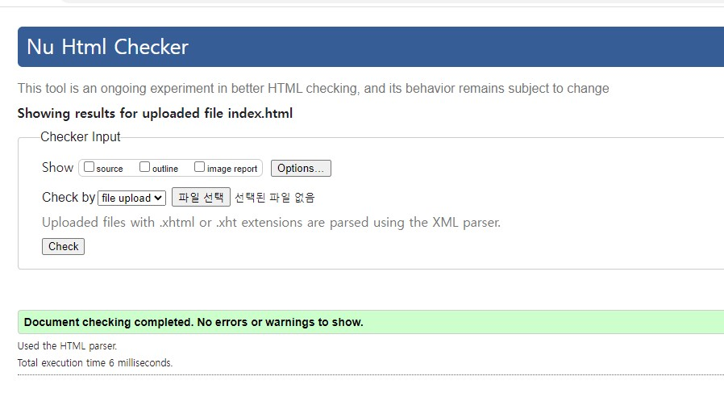
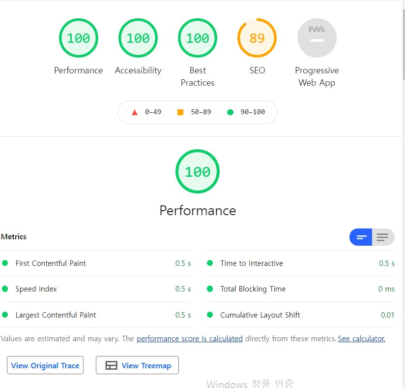

# Html / CSS 접근성 높은 데이터 테이블 제작 
# 요구사항
## 본인이 생각했을 때, 접근성이 좋지 않은 테이블이 있는 웹페이지를 선정
- http://www.cht3pl.com/service/03

## 웹표준 준수 및 웹접근성 관점에서 기존 서비스의 문제점 분석
- 테이블의 제목은 table 요소 안에서 caption 태그를 사용하거나 figure로 마크업 할 경우 figcaption 태그로 작성해야 하지만 table에 형제 요소로 h2 태그로 사용했습니다.

- table에 구조를 theader는 테이블의 제목 셀 그룹으로, tbody는 본문 행을 의미하게 마크업을 해야 하지만 tbody에 모든 요소를 작성했습니다. 

- table 내의 내용이 없는 td의 경우 border를 위해 빈값으로 작성했지만 이러할 경우 스크린 리더를 사용하는 사용자에게 테이블의 구조의 파악을 어렵게 만드는 문제가 발생하게 했습니다.

- 데이터 테이블 작성시 테이블의 내용을 이해할수 있도록 요약 정보를 제공하는 것이 필요합니다. 요약 정보의 경우 summary를 사용해 제공할 수 있지만 Html5로 넘어오면서 caption 속성에 제목과 요약 내용을 담아야 하지만 해당 내용이 존재하지 않습니다.

- 테이블 셀들을 구분해 주는 셀이 열에도 존재하는 경우 th로 마크업을 해주어야 하지만 td로 마크업을 하였습니다.

- 테이블내에 테이블 제목 셀이 행에도 있고 열에도 있는 경우 id, headers 속성을 사용해 해당 셀이 어떤 제목셀에 포함되는지 명시 해주어야 하지만 해당 내용이 존재하지 않습니다.

- 가격표가 부피에 의해 분류되지만 본문 셀과 스타일이 다른부분이 없어 사용자의 테이블 접근성이 떨어집니다.

## 해당 이슈를 WCAG 가이드라인에 맞춰 수정 계획 선정

|원칙|설명|
|--|--|
|인식|모든 사용자는 서비스 콘텐츠를 인식할 수 있어야 합니다.|
|운용|모든 사용자는 서비스의 기능을 운용할 수 있어야 합니다.|
|이해|모든 사용자가 서비스의 콘텐츠, 기능 사용법 등을 이해하기 쉬워야 합니다.|
|견고|사용자가 이용하는 모든 기기 및 브라우저에서 접근, 사용 가능해야 합니다.|

- 위 표는 WACG의 4가지 원칙이지만, 데이터 테이블 하나의 접근성을 고려하기 떄문에 `인식`과 `이해`를 중심으로 작성하겠습니다.

## 웹접근성 관련 체크리스트 작성
|체크리스트 목록|확인|
|--|--|
|tr, th, td 요소를 역할에 맞게 작성 하였는가 ?|O|
|thead, tbody, tfoot요소를 역할에 맞게 작성 하였는가 ?|O|
|테이블의 제목을 테이블 내의 작성 하였는가 ?|O|
|테이블의 요약 내용을 작성 하였는가 ?|O|
|id, headrs속성으로 해당 제목 셀과 내용 셀의 관계를 지정하였는가 ?|O|
|테이블 내의 내용 없는 셀들의 의미를 명시 하였는가 ?|O|

 

## 문법 검사 결과 제출

 

## 라이트하우스에서 접근성 및 SEO 관련 분석 리포트 제출

 

## 프로젝트 완료 후기(시행착오 및 성장기)
- 접근성이 좋지 않은 테이블이 있는 웹페이지를 찾을 때 대부분의 페이지의 테이블들은 문제가 없다고 생각해 선정하지 못하고 있었다. 한 두가지의 문제점이 있는 테이블을 찾았고, 이걸로 과제를 어떻게 진행할지 막막해 하고 있었는데, 과제를 시작하고 생각이 많이 바뀌였다. 생각 하던 것보다 훨씬 더 많은 웹 접근성을 높이기 위한 기준이 있었고, 이런것 까지 고려 해야 하는구나라는 생각까지 들 정도였다. 특히 테이블의 제목을 명시 했음에도 불구하고 스크린 리더를 사용하는 사용자에게는 테이블의 전체 내용을 한번에 파악하기 어렵기 때문에 테이블의 요약 내용을 제공해야 하고, 스크린 리더는 한 열씩 밖에 못읽기 떄문에 id, header 혹은 scope로 해당 셀이 어떤 영역에 포함되어 있는지 설정해줘야 한다는 것 등에 많은 깨달음을 얻었고, 테이블 뿐만 아니라 input, 시멘틱 태그, 반응형 웹 등에 다양한 요소에 대한 접근성을 공부하는 계기가 되었다.