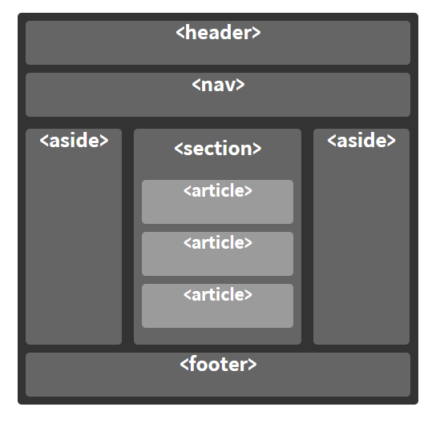

# 텍스트 요소 / 구조를 나타내는 요소 - 0831
## 제목 - h1 ~ h6
- `<h1>` ~ `<h6>` 까지 존재한다.
- 웹 브라우저가 heading의 정보를 수집해 목차를 만드는 작업을 수행한다.
- heading의 단계를 건너뛰는 것을 피하고 순차적으로 기입하는것을 권장함
- 페이지 당 하나의 `<h1>`을 사용하는것을 권장한다, 문서 전체의 제목으로 스크린 리더 사용작의 접근성이나, SEO에도 더 적합하다.
```html
<h1>Heading elements</h1>

<h2>Summary</h2>
<p>Some text here...</p>

<h2>Examples</h2>
<h3>Example 1</h3>
<p>Some text here...</p>

<h3>Example 2</h3>
<p>Some text here...</p>

<h2>See also</h2>
<p>Some text here...</p>
```

## 본문 p
- 하나의 문단을 나타냅니다.
- 블록레벨 요소
- 빈 요소를 사용해 문단 사이에 여백을 추가하면 안된다. 스크린 리더 사용자에게 혼란을 느끼게 할 수 있기 때문이다.
```html
 <p>lorem</p>  
 <!--긴 문장을 포현하기위 lorem을 입력하면 자동으로 테스트 긴문장을 표현해줌 -->
```
## 본문 - br
- 줄바꿈 요소
- html에서는 enter를 구분하지 않으므로 enter라고 생각하면 된다.
- `<br>` 혹은 `<br/>`로 작성한다.
- 연관성 있는 `<p>` 태그 사이에는 `<br>` 구분하기 보단 margin으로 구분하는걸 권장한다.

```html
<p> O’er all the hilltops<br>
    Is quiet now,<br>
    In all the treetops<br>
    Hearest thou<br>
    Hardly a breath;<br>
    The birds are asleep in the trees:<br>
    Wait, soon like these<br>
    Thou too shalt rest.
</p>

```
## 본문 - blockquote, q
- 두 태그다 인용을 목적으로 한 태그이다.
- blockquote는 블록요소, q는 인라인 요소이다.
- p태그 내에서는 blockquote를 사용하면 안된다.
- cite 속성 : 인용문의 출처 문서나 메시지를 가리키는 용도이다. 
```html
<!-- blockquote -->
<figure>
    <blockquote cite="https://www.huxley.net/bnw/four.html">
        <p>Words can be like X-rays, if you use them properly—they’ll go through anything. You read and you’re pierced.</p>
    </blockquote>
    <figcaption>—Aldous Huxley, <cite>Brave New World</cite></figcaption>
</figure>
```
```html
<!-- q -->
<p>When Dave asks HAL to open the pod bay door, HAL answers: <q cite="https://www.imdb.com/title/tt0062622/quotes/qt0396921">I'm sorry, Dave. I'm afraid I can't do that.</q></p>
```

## 본문 - pre
- 미리 서식을 지정한 텍스트를 나타낸다.
- space, enter를 작성한 그대로 보여준다.
- 고정 폭 글꼴이므로 모든 문자와 같은 폭을 가진다.
```html
<pre>
  -----------------------
         \   ^__^
          \  (oo)\_______
             (__)\       )\/\
                 ||----w |
                 ||     ||
</pre>
```

## 본문 - figure, figcaption
- figur은 연관된 태그들을 하나의 figur로 묶어주는 역활이다.
- figcaption은 요소를 사용해 설명을 붙일 수 있다.
```html
<figure>
  <figcaption><cite>Edsger Dijkstra:</cite></figcaption>
  <blockquote>If debugging is the process of removing software bugs,
  then programming must be the process of putting them in.</blockquote>
</figure>
```
## 본문 - hr
- 수평선을 만들때 사용한다.
- 문단과 문단을 나눌때 대부분 사용한다.
- `<hr>` 혹은 `<hr/>`
```html
<p>
This is the first paragraph of text.
This is the first paragraph of text.
This is the first paragraph of text.
This is the first paragraph of text.
</p>

<hr>

<p>
This is second paragraph of text.
This is second paragraph of text.
This is second paragraph of text.
This is second paragraph of text.
</p>
```

## 본문 - abbr, address, cite, bdo
- 모든 태그에 title 속성을 사용할 수 있다.
- `<abbr>` : 약어로 작성하고 원래 의미를 설명할때 
- `<address>` : 주소를 담고있는 의미를 전달하고 싶을 때 
- `<cite>` : 인용의 출처를 눈에 보이게 나타내고 싶을 때
- `bdo` : 텍스트를 반대방향으로 작성할 때
```html
<abbr title="World Wide Web">WWW</abbr>
<address>인천 연수구 옥련동</address>
<cite>Nineteen Eighty-Four</cite>
<bdo dir="rtl">이 글은 오른쪽에서 왼쪽으로 작성합니다.</bdo>
```

## 포매팅 - b, strong
- `<b>` : 굵은 글씨로 강조하기, strog보다는 중요도가 떨어지지만 어느정도 중요성을 강조하고 싶을 때
- `<strong>` : 굵은 글씨로 강조하기, 다른 내용에 비해 중요도가 높을 때
- 스크린리더를 사용자에게는 b태그는 강조해서 읽진 않지만, strong은 강조해서 읽는다.
```html
<p>
  This article describes several <b class="keywords">text-level</b> elements.
  It explains their usage in an <b class="keywords">HTML</b> document.
</p>

<p>... the most important rule, the rule you can never forget, no matter how much he cries, no matter how much he begs: <strong>never feed him after midnight</strong>.</p>
```

## 포매팅 - i, em
- `<i>` : 기울임꼴로 표시, 주위와 구분해야 하는 부분을 나타낸다. 
    - 기술 용어, 외국어 구절, 등장인물 생각 등을 예시로 들 수 있다.
- `<em>` : 기울임꼴로 표시, 문장 전달 중 강세를 나타낼때 사용한다.
```html
<p>I looked at it and thought <i>This can't be real!</i></p>
<p>Get out of bed <em>now</em>!</p>
```

## 포매팅 - mark, small, sub, sup
- `<mark>` : 중요한 내용이라 하이라이트 처리한 부분을 나타낸다.(형광펜)
- `<small>` : 덧붙이는 글이나, 저작권과 법률 표기 드으이 작은 텍스트를 나타낸다.
- `<sub>` : 아래 첨자 요소, 수식을 작성할때(x의 제곱)
- `<sup>` : 위 첨자 요소, 화학식을 사용할때, 각주

## 포매팅 - del, ins, code, kbd
- `<del>` : 삭제돤 요소를 표현할 때
- `<ins>` : 추가된 요소를 표현할 때 
    - del, ins 둘다 cite 속성 변경점을 설명하는 리소스의 url
    - datetime 변경된 날짜의 속성을 사용가능하다.
- `<code>` : 문장의 코드단어를 짧게 사용하고 싶을 때 사용, 고정폭 글시체를 가진다.
- `<kbd>` : 키보의 있는 내용을 나타날때 ctrl, shift같은 요소들
```html
<blockquote>
    There is <del>nothing</del> <ins>no code</ins> either good or bad, but <del>thinking</del> <ins>running it</ins> makes it so.
</blockquote>

```
## a 태그와 하이퍼링크
- href속성을 통해 다른 페이지나 같은 페이지의 어느 위치, 파일, 이메일주소와 그외 다른 url로 연결할 수 있는 하이퍼링크를 만든다.
```html
<!-- href 속성 -->
<!-- 절대경로 -->
<a href="https://example.com">Website</a>
<!-- 상대경로 -->
<a href="/en-US/docs/Web/HTML">Origin-relative URL</a>
<!-- 같은 페이지의 요소로 연결 -->
<p><a href="#Section_further_down">

<!-- target 속성 -->
<!-- 기본값은 self 현재창에서 열림 -->
<!-- blank 새창에서 열림 -->
<a href="https://example.com" target="blank">Website</a>
```

## 엔티티(Entity)
- 특수문자나, 예약어, 태그등을 그대로 표현하고 싶을 때 사용한다.
- & : `&amp;`
- < : `&lt;`
- `>` : `&gt;`
- " : `&quot;`
- 공백 : `&nbsp;`
```html
<p>문단을 나타내는 태그는 &lt;p>&lt;/p> 태그입니다.</p>
```
# 구조를 나타내는 요소
## `<div>` : 콘텐츠 분할 요소
- 여러 요소들을 묶어주기 위해 자주 쓰인다. 
- 요소가 없을 경우 css로 꾸미기 전에는 컨텐츠나 레이아웃에 어떤 영향도 주지 않는다.
- class나 id 속성으로 선택자를 부여 할 수 있다.
- block 요소
## `<span>` : 구문 컨텐츠를 위한 등용 인라인 컨테이너
- 본질적으로는 아무것도 나타내지 않습니다.
- 스타일을 적용하기 위해서 어떤 특성의 값을 서로 공유하는 요소를 묶을 때 사용할 수 있다.
- inline 요소
```html
<div>
   <p>어떤 콘텐츠든 좋습니다.
   &lt;p&gt;, &lt;table&gt;같이 말이죠. 써보세요!</p>
</div>

<p>Gradually add the <span class="ingredient">olive oil</span> while running the blender slowly.</p>
```
## 시멘틱 웹
- html 레이아웃을 구분하기위해 div와 속성은 같지만 다른 의미를 부여하기 위해 사용하는 태그이다.
- 검색 엔진은 의미론적 마크업을 분석하여 페이지의 검색 랭킹에 영향을 줄 수 있는 중요한 키워드로 간주합니다.
- 시각 장애가 있는 사용자가 스크린리더로 페이지를 탐색할 때 의미론적 마크업을 풋말로 사용할 수 있다.
- 의미가 없는 `<div>`들을 탐색하는 것보다, 의미있는 코드 블록을 찾는 것이 훨씬 쉽습니다.
- 개발자에게 태그 안에 채워질 데이터 유형을 제안합니다.

## 시멘틱 웹 종류
- header : 소개 및 탁색에 도움을 주는 컨텐츠이다. 제목,로고,검색 폼, 작석자 이름 등의 요소를 포함한다.
- footer : 푸터는 일반적으로 구획의 작성자, 저작권 정보, 관련 문서 등의 내용을 담습니다.
- nav : 문서의 부분 중 현재 페이지 내, 또는 다른 페이지로의 링크를 보여주는 구획을 나타냅니다. 자주 쓰이는 예제는 메뉴, 목차, 색인입니다.
- aside : 문서의 주요 내용과 간접적으로만 연관된 부분을 나타냅니다. 주로 사이드바 혹은 콜아웃 박스로 표현합니다.
- main :  문서 `<body>`의 주요 콘텐츠를 나타냅니다. 주요 콘텐츠 영역은 문서의 핵심 주제나 앱의 핵심 기능에 직접적으로 연결됐거나 확장하는 콘텐츠로 이루어집니다.
- article : 문서, 페이지, 애플리케이션, 또는 사이트 안에서 독립적으로 구분해 배포하거나 재사용할 수 있는 구획을 나타냅니다. 사용 예제로 게시판과 블로그 글, 매거진이나 뉴스 기사 등이 있습니다.
- HTML 문서의 독립적인 구획을 나타내며, 더 적합한 의미를 가진 요소가 없을 때 사용합니다. 보통 <section>은 제목을 포함하지만, 항상 그런 것은 아닙니다.

<br>


